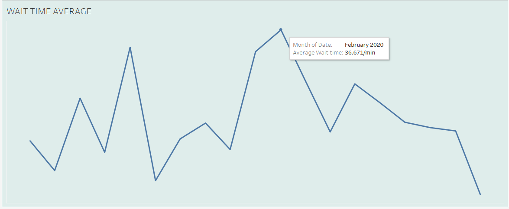
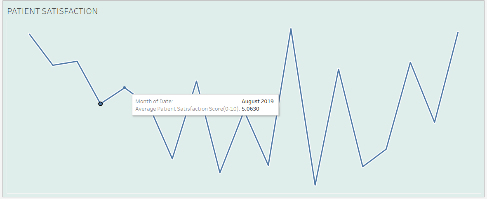
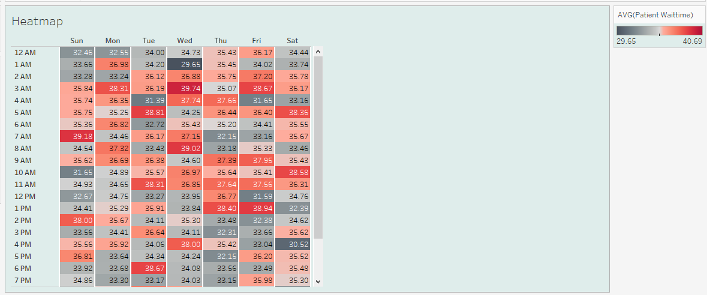
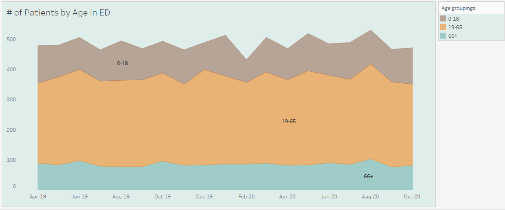
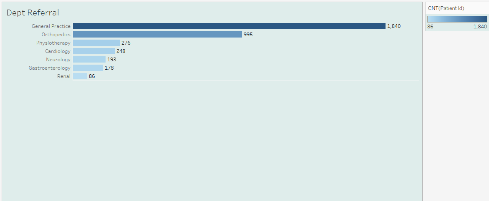

# Emergency Room (ER) Dashboard in Tableau


*Preview of my dashboard from my Tablea Public*

Demo: [Click to view the full Interactive Dashboard at tableau public](https://public.tableau.com/views/EmergenceRoomDashboard/Dashboard1?:language=en-US&:sid=&:redirect=auth&:display_count=n&:origin=viz_share_link)

## Overview

This project demonstrates how to create a dynamic and interactive Emergency Room (ER) dashboard using Tableau. The dashboard provides real-time insights into key performance indicators (KPIs) crucial for hospital management and patient care, such as:

- **Number of ER Patients**
- **Average Wait Time**
- **Average Patient Satisfaction**
- **Patient Demographics** (by age, race, and sex)
- **Heatmap of Average Wait Times by Day of the Week**
- **Referred Department Analysis**

These visualizations help address real-life hospital problems such as overcrowding, prolonged wait times, and resource allocation, ultimately enhancing patient outcomes and operational efficiency.

## Table of Contents

- [Background](#background)
- [Data Sources](#data-sources)
- [Methodology](#methodology)
- [Dashboard Features](#dashboard-features)
- [Getting Started](#getting-started)
- [Project Structure](#project-structure)
- [Screenshots](#screenshots)
- [Future Enhancements](#future-enhancements)
- [Contributing](#contributing)
- [License](#license)

## Background

As a medical doctor i have witnessed first hand how Emergency Departments (ED) often face challenges such as overcrowding, prolonged wait times, and difficulty in measuring patient satisfaction in real time. By leveraging data analytics and visualization, this ER dashboard provides actionable insights for:
- Optimizing patient flow and staffing,
- Reducing wait times,
- Improving patient experience, and
- Monitoring key demographic trends to drive equitable care.

## Data Sources

The dashboard utilizes simulated and anonymized hospital data including:
- ER visit logs (number of patients, time stamps)
- Patient wait time records
- Patient satisfaction survey results
- Demographic information (age, race, sex)
- Referral data (referred departments)
- Timestamped data for heatmap visualization

*Note: For demonstration purposes, synthetic data was generated to emulate real-world ER operations.*  
*Source: https://data.world/markbradbourne/rwfd-real-world-fake-data/workspace/file?filename=Hospital+ER.csv*

## Methodology

1. **Data Collection & Preparation:**
   - Data was dwnload from the provided source by real world fake data.com and exported into CSV files.
   - Data cleaning and transformation were performed using Excel to ensure consistency and accuracy.
   - Key metrics were defined, such as average wait time and patient satisfaction scores.

2. **Building the Dashboard in Tableau:**
   - Imported CSV datasets into Tableau.
   - Created calculated fields for metrics such as average wait time, and grouped data by age, race, and sex.
   - Calculated Fields
   ```
   # calculating average wait time and patient satisfaction score

   AVG(patient_waittime)

   AVG(patient_sat_score)

   ```
    
   - Developed multiple visualizations:
     - A line graph tracking average wait times and average patient satisfaction score over a year.
    
    *Linechart showing monthly trend of average wait time in ER*

        
        *Linechart showing monthly trend of average patient satisfaction score in ER*

     - A heatmap of wait times by day of the week.
     
     *Heatmap showing fluctuation of average wait time over the week*

     - Age distribution using customized bins
     
     *Age distribution using bins*

     - Analysis of referred departments.
     
     *Barchart showing referred departments*
   - Combined these calculated fields and visualizations into a single interactive dashboard.

3. **Testing & Iteration:**
   - The dashboard was refined based on feedback from clinical experts and hospital administrators.
   - Iterative testing ensured that the dashboard was user-friendly and provided actionable insights.

## Dashboard Features

- **Real-Time ER Visit Tracker:** Displays the number of patients visiting the ER each day.
- **Average Wait Time:** Interactive line graph showing wait time trends.
- **Patient Satisfaction Index:** Visualization of survey results to gauge the overall patient experience.
- **Demographic Analysis:** Charts that break down patient data by age, race, and sex.
- **Heatmap:** A visual heatmap of average wait times across the week for quick identification of peak periods.
- **Referred Departments:** Analysis of which departments receive the most referrals from the ER.

## 📈 Business Impact
- Reduced Wait Times: Hospitals can reallocate staff during peak hours.

- Equity Audits: Flag racial/gender disparities in care delivery.

- Resource Optimization: Predict ICU/surgery referrals for better staffing.

## Future Enhancements
- Integration with Live Data: Connect the dashboard to real-time hospital data systems.
- Predictive Analytics: Incorporate machine learning models to forecast ER demand and patient flow.
- Mobile-Friendly Version: Develop a version optimized for tablets and smartphones for on-the-go insights.
- Expanded KPIs: Include additional KPIs such as readmission rates and treatment outcomes.

## Getting Started

### Prerequisites

- Tableau Desktop (version 2020.1 or later recommended)
- CSV data files (sample files provided in the `/csv_files` folder)
- Basic knowledge of Tableau and data visualization concepts

### Installation & Running

1. **Clone the repository:**

   ```bash
   git clone https://github.com/yourusername/ER-Dashboard-Tableau.git
   cd ER-Dashboard-Tableau
